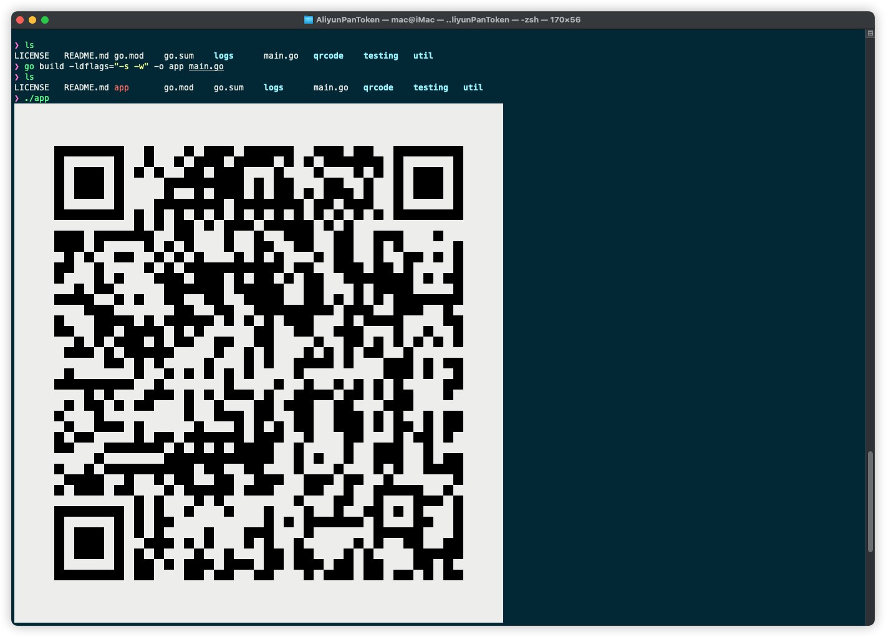
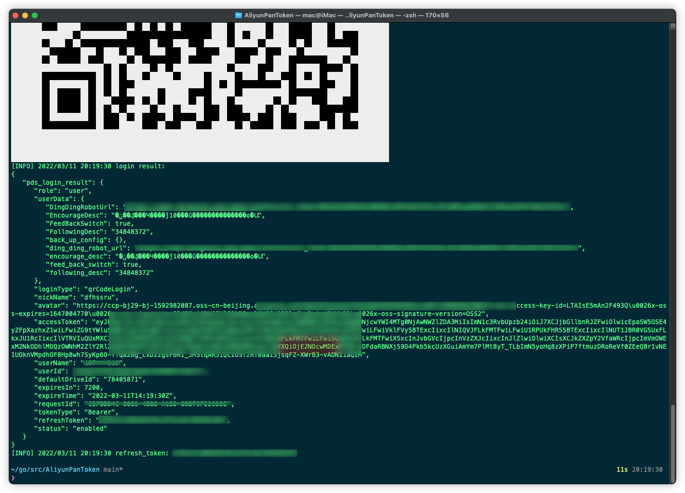

[](https://github.com/gngpp/qrcode-token/actions/workflows/release.yml)
# qrcode-token
基于阿里云盘抓包接口编写的一个从命令行`QR Code`扫码获取阿里云盘`refresh_token`的工具，使用移动客户端APP `QRCode`扫码登录，获取的refresh_token，支持`alist`直链下载。

### 使用
- 自行编译安装（依赖cgo，确保存在gcc环境）
```shell
# 拉取源码
git clone https://github.com/gngpp/qrcode-token.git && cd qrcode-token
# 拉取依赖
go mod tidy
# 编译
go build -ldflags="-s -w" -o qrcode-token main.go
# 执行
./qrcode-token
```
> openwrt环境下需要安装gcc（固件一般不会自带）
```shell
opkg update && opkg install gcc
ar -rc /usr/lib/libpthread.a
```

- 下载Release包
```shell
wget https://github.com/gngpp/qrcode-token/releases/download/v1.3/linux_amd64_qrcode-token.tar.gz
tar zxvf ./linux_amd64_qrcode-token.tar.gz
# 放在Linux bin目录可以直接执行了
mv ./qrcode-token /usr/bin

# macOS
mv ./qrcode-token /usr/local/bin
```
- 获取手机端和Web端token
```shell
# 获取手机端登陆token
qrcode-token --mobile=true

# 获取Web端登陆token
qrcode-token # or qrcode-token --mobole=false
```

### 示例



